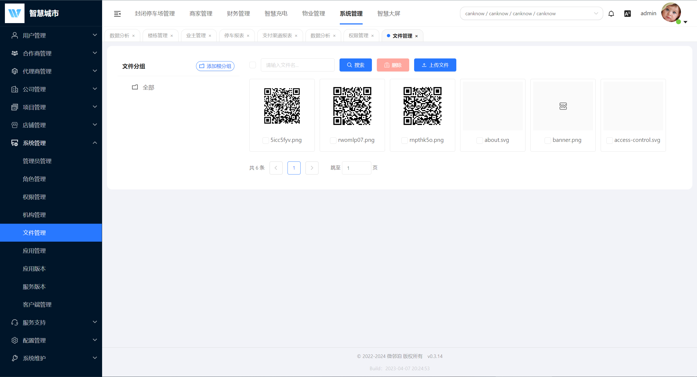

# 后台管理

## 封闭停车场管理

### 数据分析
主要记录并显示当日的停车场数据;例如:今日入场数、今日出场数、场内车辆数、今日停车费、近15日订单趋势等数据显示

### 停车场管理

#### 停车场列表
停车场可配置通行权限，临停车、内部车、月卡车、免费车。临停车和内部车可设置收费规则，内部车收费规则也可以在内部车分组上设置。 停车场可以开启盒子，开启后，相机数据由盒子处理，然后同步到云端。启用第三方平台，数据会通过mq与第三方平台服务通信，由第三方平台付款通行。


#### 岗亭管理
主要是对通道进行分组。
#### 通道管理
配置进出口道闸的主辅相机，控制卡类型，通道权限。控制卡目前支持方控、E6、科发。


#### 相机管理
目前平台相机品牌已经对接臻识、海康、千熠、华夏。


#### 收费规则
采用策略模式设计收费规则，支持收费规则模板类型的扩展，目前支持免费模板和通用模板。通用模板支持按车牌、按日期类型、按时/按次的多时段收费规则设置。


### 二维码列表
对入场码、出场码、场内码进行管理，也可以作废，扫码提示码不可用。
### 访客管理
可在后台生成访客码或者直接创建访客，便于访客进出停车场免费。同时还可以导出访客使用后的列表记录。
### 月卡管理
每个月卡套餐或者月卡商品支持多个停车场，可以绑定多个车牌，当购买一个月卡商品后，会生成该月卡多个停车场的各个月卡，车主在这些停车场均享有相同的月卡权益。每个车场月卡可以绑定到多个车，但一个车场只支持同时一辆车在场。月卡类型有普通、业主、租户，业主可以看到对应项目下面的业主类型月卡套餐进行购买。可在后台创建月卡或者续费已有月卡，也可在用户端进行购买和续费。


### 内部车管理
内部车分组可以单独设置收费规则，内部车车辆进出道闸会播报对应内部车分组名称。
### 业主车管理
业主车可以没时间限制进出停车场。
### 黑名单列表
设置黑名单车辆无法进入停车场。
### 车辆管理
用户在手机端绑定自己的车辆，可用于余额扣费和购买月卡。
### 停车记录
车辆进入停车场即生成停车记录，如果之前因异常存在场内订单，再次进入会重新生成订单并把之前订单设置异常。车辆出场时候如果无费用可直接出场，如果有费用，可以在场内扫场内码，直接出场，或者扫出场码付款出场。


### 值班管理
岗亭端使用，创建不同停车场的值班人员信息，记录岗亭端交接班信息。
### 系统维护
#### 开闸记录
记录通道开闸信息。
#### 车牌识别记录
记录相机识别车牌识别信息，包括相机拍照的图片及车辆颜色等等。

## 商家管理
### 商家管理
公司管理员在后台管理商户，一个商户可以适用多个停车场。
### 员工管理
公司管理员在后台为商家创建管理员，通过将创建后的二维码发送给商家员工扫码绑定他微信小程序，在商家小程序管理商家的停车券和员工。


### 停车券管理
一个停车券商品适用一个停车场，创建后可以在后台直接给商家发放，或者商家员工在商家小程序中进行购买，在小程序中点击领券二维码将停车券让车主扫码并输入车牌领取，抵扣停车订单的相应费用。


## 财务管理

### 钱包记录
记录客户在使用钱包余额支付时的数据变动
### 充值套餐
设置钱包充值套餐，可设置充值优惠，可充值赠送，也可充值时打折。
### 合作商支付配置
合作商作为数据隔离基本单位，可添加支付渠道，合作商的支付参数可用来钱包充值的支付渠道，也可以已支付服务商形式向下面的公司提供支付通道。
现在目前已经对接支付渠道有```微信```、```支付宝```、```余额```、```银联```、```第三方```、```聚合支付```、```富友支付```、```数科支付```。


### 公司支付渠道
在合作商添加的支付渠道中，公司可以选择性开通自己的支付渠道，如果是服务商模型，公司作为子商户，否则公司单独收款。


### 报表统计
#### 停车报表
可查看每日或者每月客户支付金额的详细信息不同停车场不同收款类型的报表信息。


#### 支付渠道报表
可查看支付渠道维度每日或者每月客户支付金额的详细信息。

### 账单
#### 停车账单 
记录所有的即时支付账单管理，也是有停车场id的账单
#### 通用账单
所有的支付都会产生这个账单，包括即时支付，月卡扣除，余额扣除等待

## 物业管理
物业功能开发中，目前已完成楼栋管理、业主管理。

### 楼栋管理
以项目为单位管理楼栋、单元、楼层、房间。


### 业主管理
管理业主和租户。


## 系统管理

### 合作商管理
合作商类似租户的概念，不同合作商数据完全隔离，创建合作商时候需要填写独立域名，根据访问系统的域名判断是哪个合作商来过滤数据。每个合作商可以配置的自己的微信服务商参数，合作商下面各个公司作为服务商子商户收款，也可以采用微信直连支付。创建合作商时候需要填写该合作商的默认管理员用户密码，合作商创建后，会自动创建该用户，同时创建一个默认该合作商角色，拥有合作商默认的所有权限。

### 代理商管理
合作商下可以选择性创建代理商,代理商就是我去给你推广

### 公司管理
每个公司可以管理多个项目，每个公司可以配置合作商微信支付服务商的子商户账号单独收款。创建公司时候需要填写该公司的默认管理员用户密码，公司创建后，会自动创建该用户，同时创建一个默认该公司角色，拥有公司默认的所有权限。

### 项目管理
项目类似小区的概念，可以管理该小区内的停车场、物业、充电桩等等功能模块。

### 店铺膜版管理
小程序首页的模板管理

### 系统管理
#### 管理员管理
前端和用户和后台管理员是用的同一张表，如果需要使用不同表也可以很方便改造。管理员根据所属范围不同分为平台管理员、合作商管理员、公司管理员，平台管理员可以查看所有合作商及公司的数据，合作商管理员可以查看该合作商数据及下属所有公司数据，公司管理员可以查看公司数据。
#### 角色管理
系统采用RBAC的角色权限体系，每个用户可以分配多个角色，每个角色可以分配多个权限，角色根据所属范围不同分为平台角色、合作商角色、公司角色。系统采用RBAC的角色权限体系，每个用户可以分配多个角色，每个角色可以分配多个权限，角色根据所属范围不同分为平台角色、合作商角色、公司角色。
#### 权限管理
不通权限有不同的使用范围，比如是合作商还是代理商，或者公司和项目，那么不同层级下面可以分配权限就只属于该层级范围。


#### 机构管理
管理各个层级的部门机构。

#### 文件管理
系统支持阿里云对象存储、七牛云对象存储、腾讯云对象存储、mino对象存储，可以在环境变量中灵活配置存储提供器。系统文件上传都通过统一文件上传接口，包括后台管理中的图片上传，车牌识别结果图片存储等等。后台提供文件管理查看上传的图片，可以添加文件分组对上传的图片进行分组管理。
不同层级的用户上传的文件也归属于不同层级。



#### 客户端管理
主要是授权服务用到管理授权客户端的接入凭证。


#### 应用版本
用于管理APP端的app版本自动升级。APP端主要是计划开发岗亭端APP，目前还没开发。
#### 服务版本
用于管理盒子端程序的自动升级。没用到，盒子端目前是docker部署，通过watch自动升级。后面准备不用docker，直接跑jar包，所以该功能还是要用到的。
#### 应用管理
用于第三方平台接入。创建应用后，使用应用ID和密钥进行接口调用。

### 服务支持
#### 反馈建议
目前只有后台管理，计划在用户端小程序中做提交。
#### 通知公告
只有后台管理，计划在用户端小程序中做展示。
#### 新闻管理
为后续开发app时开发的功能。
#### 帮助管理
为后续开发app时开发的功能。

### 配置管理
#### 应用设置
系统提供统一的配置管理服务，类似数据字典，根据范围配置分为系统配置、合作商配置、公司配置、用户配置，后台管理中应用设置、微信设置均由配置服务管理。
#### Srs配置
srs配置就是配置流媒体服务器的参数，供云端播放以及盒子端推流使用。
#### 微信配置
配置微信开放平台、小程序和公众号的参数
#### 短信配置
配置发送手机短信的参数。目前支持阿里云短信和蓝树云。


### 系统维护
#### 在线用户
就是当前登录的用户。可以强制踢下线
#### 审计日志
主要是通过注解或者主动调用记录接口的调用情况，包括结果、请求参数、用户id、响应时间、错误码等信息。目前只做了部分接口的记录，待完善。
#### 区域管理
区域管理就是管理行政区划表，在选择停车场区域时候会用到。
#### 缓存管理
清除redis缓存。


## 充电桩
目前已开发功能包括充电站管理、充电桩管理、充电订单，充电站可以属于一个停车场，也可以独立存在，当属于一个停车场后，通过设置充电策略可以抵扣停车费。目前充电站正在适配友电充电桩。如果其它品牌充电站需要另外做适配。


