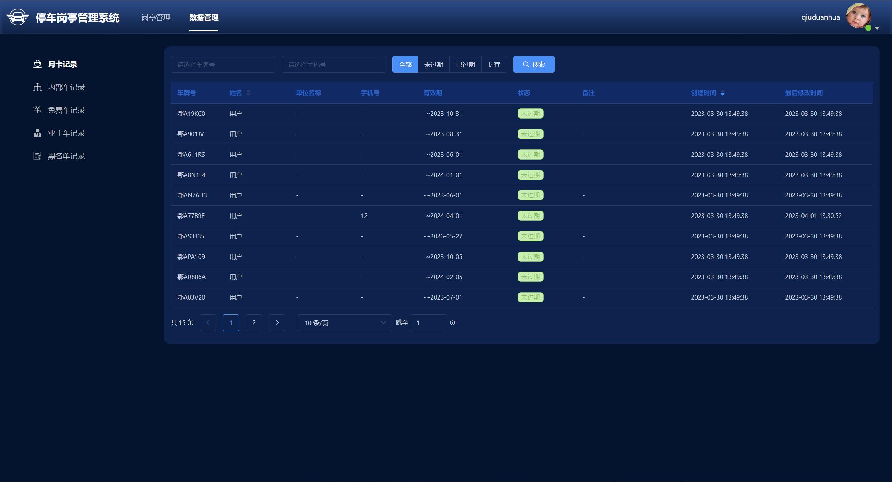

# 云岗停
## 登录
在后台管理创建值班员，通过账号密码登录云岗停

## 岗亭选择
选择需要管理的岗亭进入岗亭管理界面

## 岗亭管理界面
1. 左右进出通道可观看主相机实时视频，本地可以切换到本地视频获取最佳体验，云端视频需要采用盒子端推流实现。 
2. 车辆入场时右侧会实时显示入场车辆，当停车场启用入场人工确认后需要人工确认开闸进场。
3. 车辆出场时候右侧会实时显示出场车辆，可允许出场开闸完成订单。
4. 登录后可以点击值班按钮交接班。

## 数据管理
查询月卡、内部车、业主车、黑名单等信息

