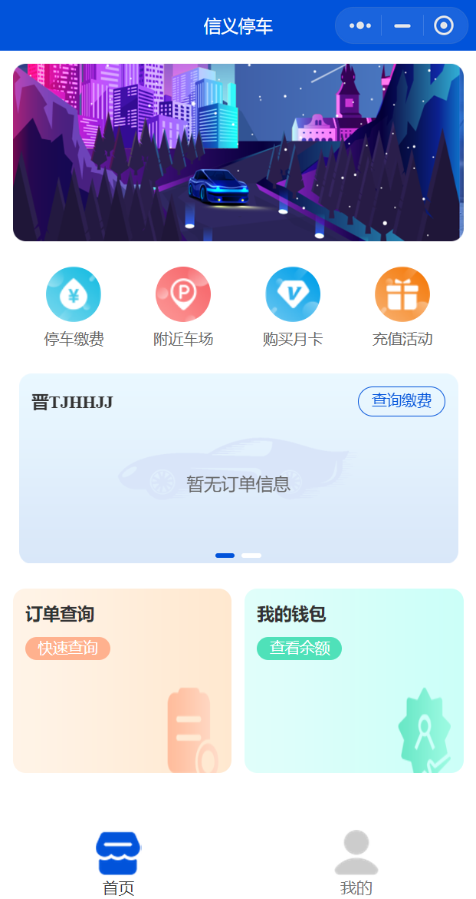
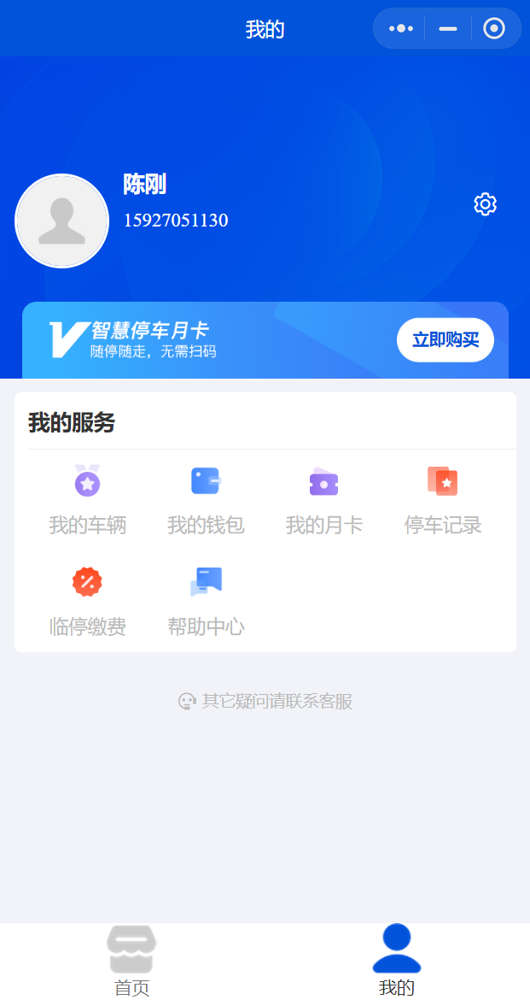
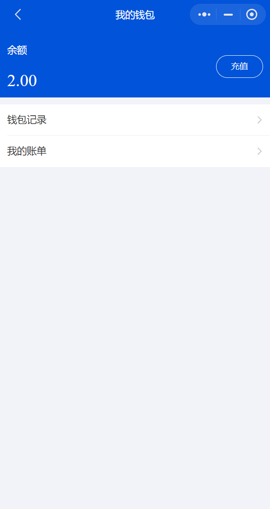
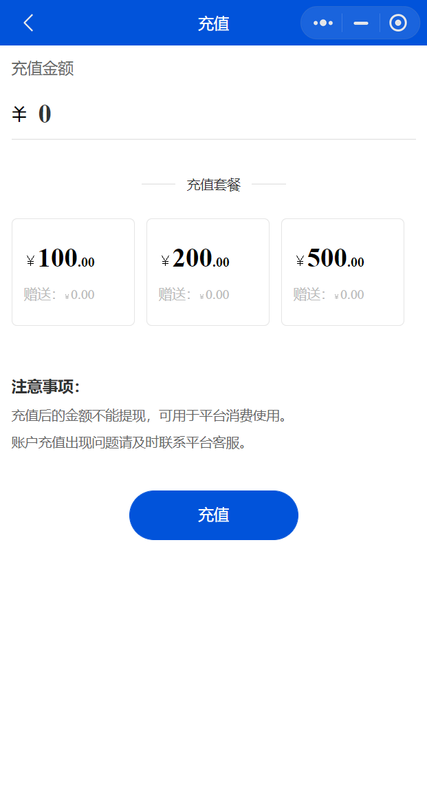
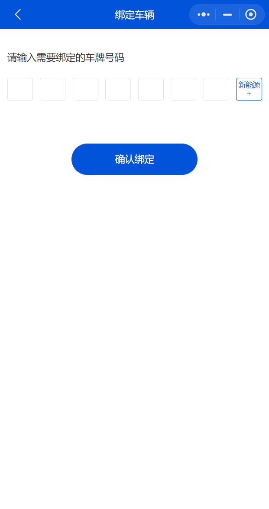
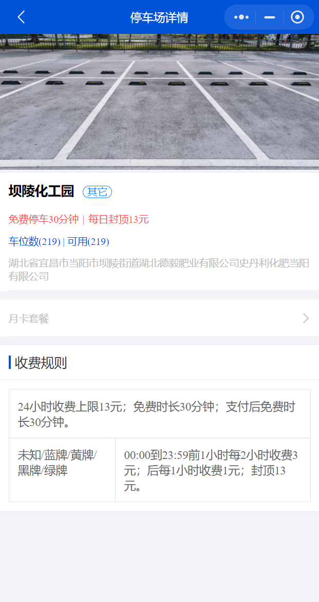
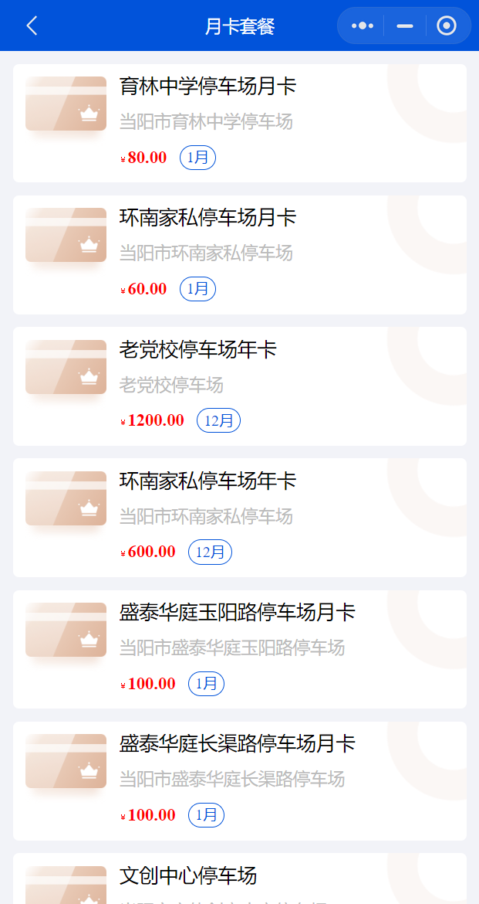
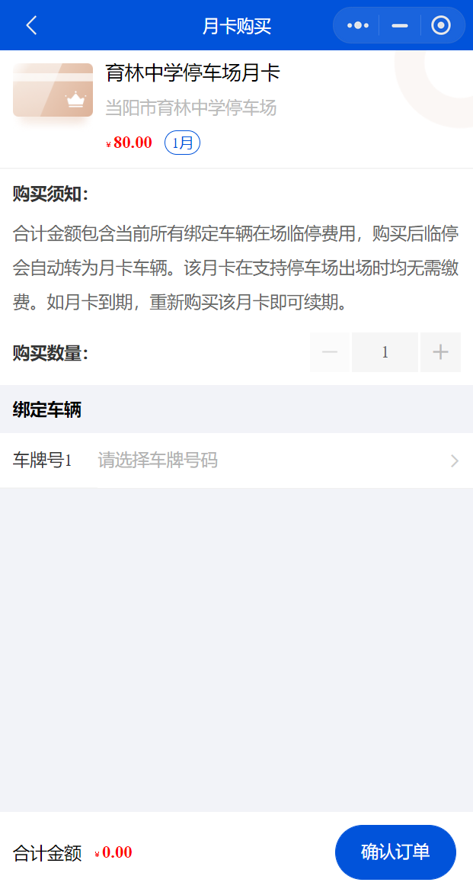
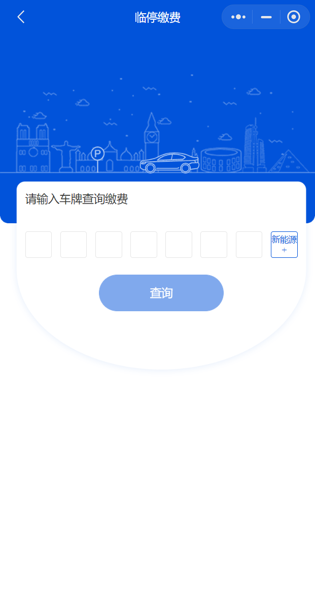
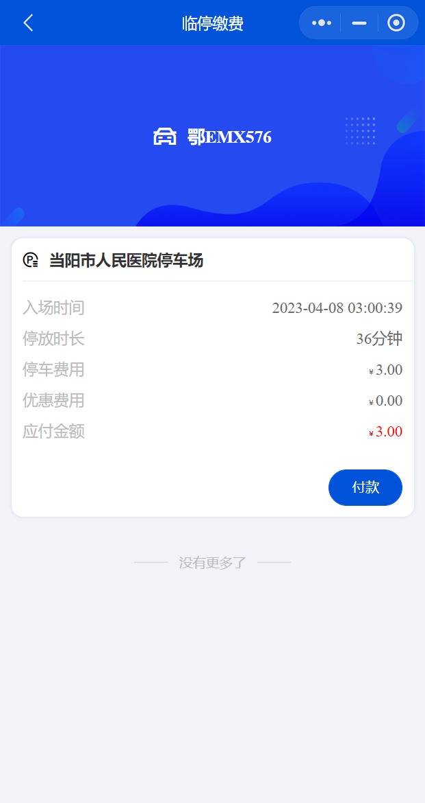

# 用户端H5/微信小程序
用户端包括H5和微信小程序，两者界面一样。

## 首页
首页会展示已绑定车牌的停车状态。

## 我的

## 钱包
用户钱包展示钱包余额，查询钱包记录和账单，进行余额充值。

 | 
--- | ---

## 车辆管理
用户绑定自己的车牌，用于余额自动代扣以及购买月卡。

 | 
--- | ---

## 附近车场
方便用户查找附近停车场。展示信息：名称、位置、距离、停车政策、车位数、可用车位数及导航地址。

 | 
--- | ---

## 我的月卡
管理用户月卡，可进行购买和续费。

 | 
--- | ---

## 停车缴费
用户输入车牌号查询场内车辆缴费后完成订单。

 | 
--- | ---
