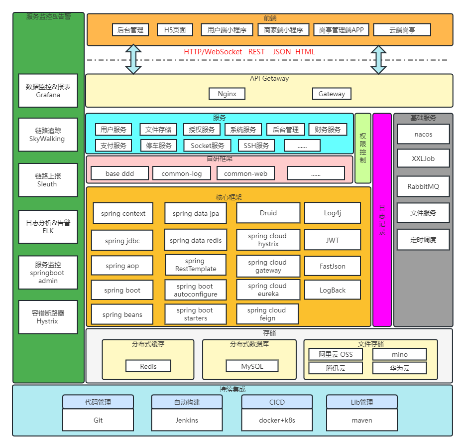

# 智慧城市系统技术架构

## 简介
本文档旨在描述智慧城市系统的技术架构，包括系统组成部分、技术选型、数据流转、服务拆分等方面。

## 架构
1. 以 Spring Boot 2 为基础，Maven 多项目依赖，模块分项目，松耦合，方便模块升级、增减模块
2. 采用六边形架构（Hexagonal Architecture），有效解耦业务逻辑和具体技术实现，从而使系统更加灵活、可扩展和可维护。该架构的核心思想是将系统分为三个部分：领域层、应用层和接口层。
   在六边形架构中，领域层负责实现业务逻辑，应用层负责协调各个领域模型之间的交互，接口层负责与外部系统进行通信。这三个部分通过端口和适配器进行连接，从而实现松耦合的设计。
3. 全面贯彻领域驱动设计（Domain-Driven Design，简称DDD），使系统更加聚焦于核心业务，更好地表达业务概念和规则。DDD强调在软件设计中贯彻领域模型的概念，以业务需求为出发点进行系统设计和开发。
4. 权限认证使用 Spring Security & Token & Redis，支持多终端、多种用户的认证系统，支持 SSO 单点登录。
5. 利用Spring Boot Admin 来监控各个独立Service的运行状态；利用Hystrix Dashboard来实时查看接口的运行状态和调用频率等。
6. 后端接口通过Spring cloud路由，静态资源和接口再由nginx统一代理。
7. 基于NaCos来实现的服务注册与调用，在Spring Cloud中使用Feign, 我们可以做到使用HTTP请求远程服务时能与调用本地方法一样的编码体验，开发者完全感知不到这是远程方法，更感知不到这是个HTTP请求。
8. 集成阿里Sentinel进行接口流量控制，通过熔断和降级处理避免服务之间的调用“雪崩”。
9. 通过JWT的方式来进行用户认证和信息传递，保证服务之间用户无状态的传递。
10. 设计合作商来实现多租户sass系统，通过域名解析当前合作商进行数据隔离。
11. 采用四层账号体系，分别是合作商、代理商、公司、项目，每一层都可以管理自己层级的管理员角色和业务数据。
12. 集成云存储：已支持阿里云OSS、腾讯云COS、七牛云、MinIO，并提供接口灵活扩展其它存储。
13. 在线查询在线人员，强踢在线账号。
14. 单元测试和集成测试使用JUnit和Spring Test，保证代码质量和可靠性。
15. 代码规范使用阿里巴巴Java开发手册，保证代码风格一致性和代码质量。
16. 版本控制使用Git，通过Coding进行代码托管和版本控制管理，实现团队协作和代码版本控制。
17. 代码质量控制使用SonarQube，对代码进行静态分析，提供代码质量和安全性检测，帮助开发团队改善代码质量和可维护性。
18. 日志收集使用ELK，通过Logstash采集、Elasticsearch存储、Kibana展示，实现日志实时查询和分析。

## 系统架构图

## 开发语言
* 云端服务 采用java语言开发，jdk版本要求1.8+。开发框架为Spring cloud Alibaba，鉴权采用spring cloud security oauth2，DB操作框架Jpa，数据通讯采用MQTT。
* 盒子端 采用java语言开发，jdk版本要求1.8+。开发框架为Spring boot，鉴权采用spring security，DB操作框架Jpa，数据通讯采用MQTT。
* 盒子端Windows打包 inno setup。
* 后台管理 vue + elementUi。
* 用户端H5 采用vue开发。
* 用户端小程序 采用uniApp开发。
* 盒子端岗亭 vue + elementUi。
* 云端岗亭 vue + elementUi。

## 服务拆分
停车系统主要包含以下组成部分：

* 用户模块
* 系统模块
* 授权模块
* 支付模块
* 财务模块
* 停车模块
* 物业模块
* 充电桩模块
* 物联网模块

## 技术选型
* Spring Boot：使用 Spring Boot 作为基础框架，方便快速开发和部署。
* Spring Cloud：使用 Spring Cloud 进行服务治理和微服务架构设计。
* MySQL：使用 MySQL作为主要数据库。
* Redis：使用 Redis缓存热点数据，如停车场、通道、登录数据等。
* RabbitMQ：使用 RabbitMQ进行消息队列处理，解耦各个模块之间的依赖关系。
* MQTT：使用MQTT进行停车场场端盒子与云端数据通讯。
* Docker：使用 Docker 进行容器化部署，方便快速迁移和部署。
* Kubernetes：使用 Kubernetes 进行容器编排和管理，保证服务高可用和弹性伸缩。
* 持久层框架：Jpa、Hibernate Validation
* 基于SkyWalking作为项目的全链路性能监控，从整体维度到局部维度展示各项指标，将跨应用的所有调用链性能信息集中展现，可方便度量整体和局部性能，并且方便找到故障产生的源头，生产上可极大缩短故障排除时间
* Elasticsearch：通过binlog与mysql数据同步，用于优化大表的数据查询。
* API网关：Spring Cloud Gateway
* 数据库连接池：Alibaba Druid
* JSON序列化：Jackson&FastJSON
* 日志收集：E(Elasticsearch)+L(Logstash)+K(Kibana)
* 安全框架：Spring Cloud Security OAuth2+JWT
* 分布式事务：Seata

## 操作系统支持
桌面操作系统 开发环境
* Windows 10+
* MacOS

服务器操作系统 测试生产环境
* CentOS 7+
* RedHat 7+
* Ubuntu 16+

## 持续集成
* Jenkins
* Gitlab-ci

## 部署方式
* Rancher
* Docker
* Kubernetes
